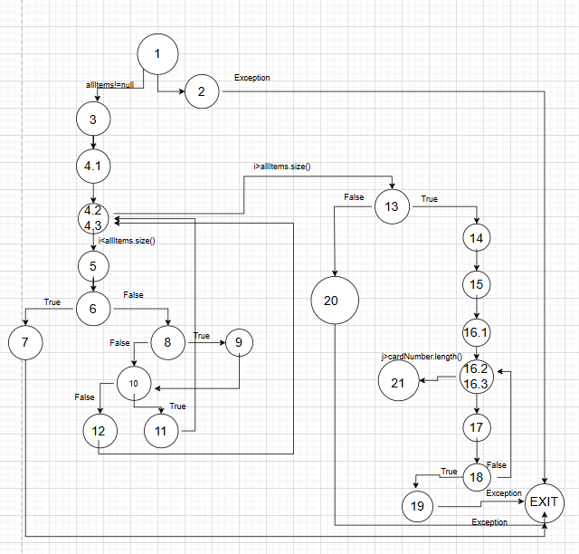
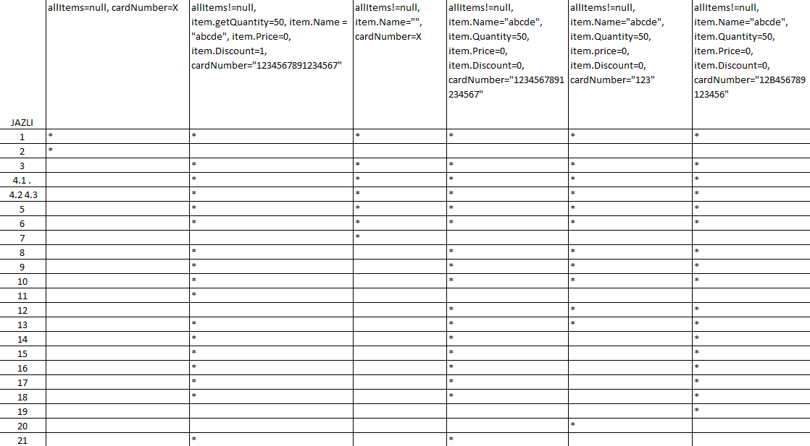
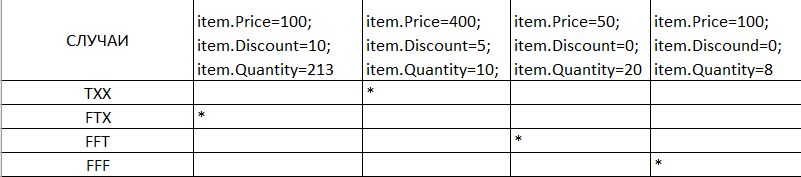

# SI_2025_lab2_233016
Marija Pantazieva 233016

Цикломатската комплексност на овој CFG е 9, и се пресметува по следната формула: БРОЈ НА ПРЕДИКАТНИ ЈАЗЛИ + 1, 8+1=9. Исто така може да се пресмета и по следната формула:

(БРОЈ НА РЕБРА - БРОЈ НА ЈАЗЛИ)+2.

ТЕСТ СЛУЧАИ СПОРЕД КРИТЕРИУМОТ EVERY STATEMENT

За да се постигне Every Statement критериумот, потребни се минимум 6 тестови.  

Тест 1 - Тест кој предизвикува исклучок за null објект.

Тест 2 - Тест за успешно завршување и враќање на износот на сумата.

Тест 3 - Тест за невалидно име на објект од типот Item.

Тест 4 - Тест за објект кој има попуст со вредност 0.

Тест 5 - Тест за невалидна должина на бројот на картичка.

Тест 6 - Тест за невалидни карактери во бројот на картичка.

Секој од овие тестови ќе покрие различен дел од функционалноста на кодот, обезбедувајќи дека секој дел од кодот е проверен во соодветен контекст.                                                           

ТЕСТ СЛУЧАИ СПОРЕД КРИТЕРИУМОТ MULTIPLE CONDITION   ЗА УСЛОВОТ if (item.getPrice() > 300 || item.getDiscount() > 0 || item.getQuantity() > 10)

1.Случај:

TXX - item.Price=400; item.Discount=5; item.Quantity=10; ако item.getPrice>300 условот поминува бидејќи е ЛОГИЧКО ИЛИ и другите случаи не ни се битни дали се true или false.

2.Случај:

FТX - item.Price=100; item.Discount=10; item.Quantity=213; кога item.getPrice<300 условот враќа false, па се проверува и вториот услов односно дали item.getDiscount() > 0 овде е исполнет тој услов и целиот услов

ке помине, ќе врати true, па третото item.getQuantity() > 10 не се проверува

3.Случај:

FFT - item.Price=50; item.Discount=0; item.Quantity=20; првото item.getPrice() > 300 враќа false, се проверува и второто item.getDiscount() > 0 , и тоа враќа false, и го проверуваме и третото item.getQuantity() > 10, и целиот услов поминува бидејќи ова враќа true

4. Случај:

FFF - item.Price=100; item.Discound=0; item.Quantity=8; првото проверување во if-от враќа false, одиме и го проверуваме второто и тоа враќа false, се проверува и третото и тоа враќа false и целиот услов паѓа. 

Со овие тестови се поминуваат сите можни случаи за овој услов.

